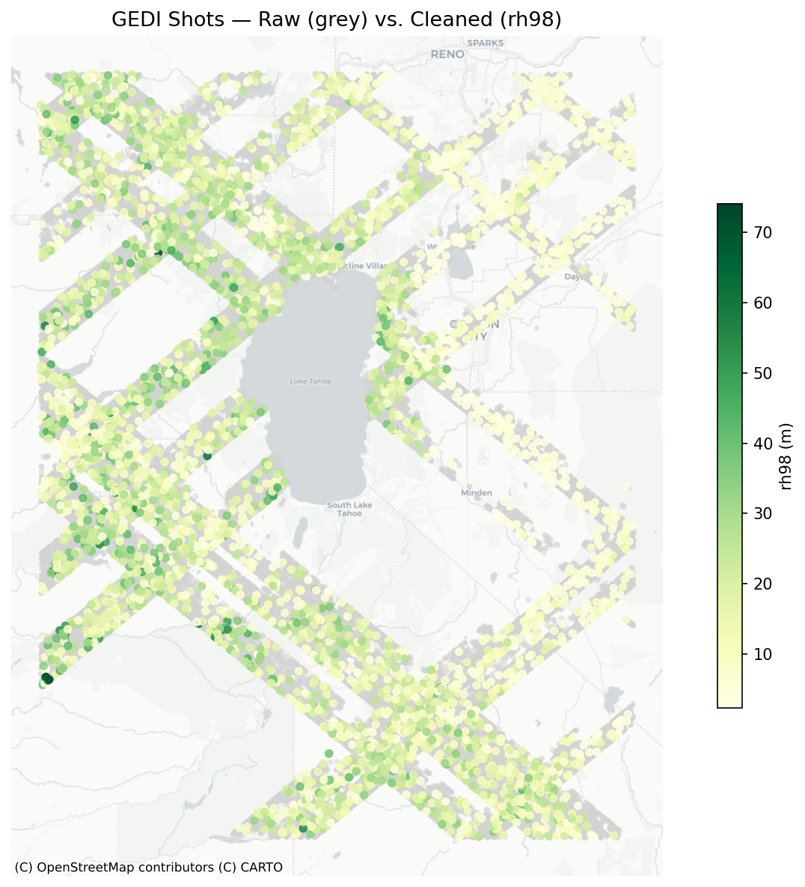
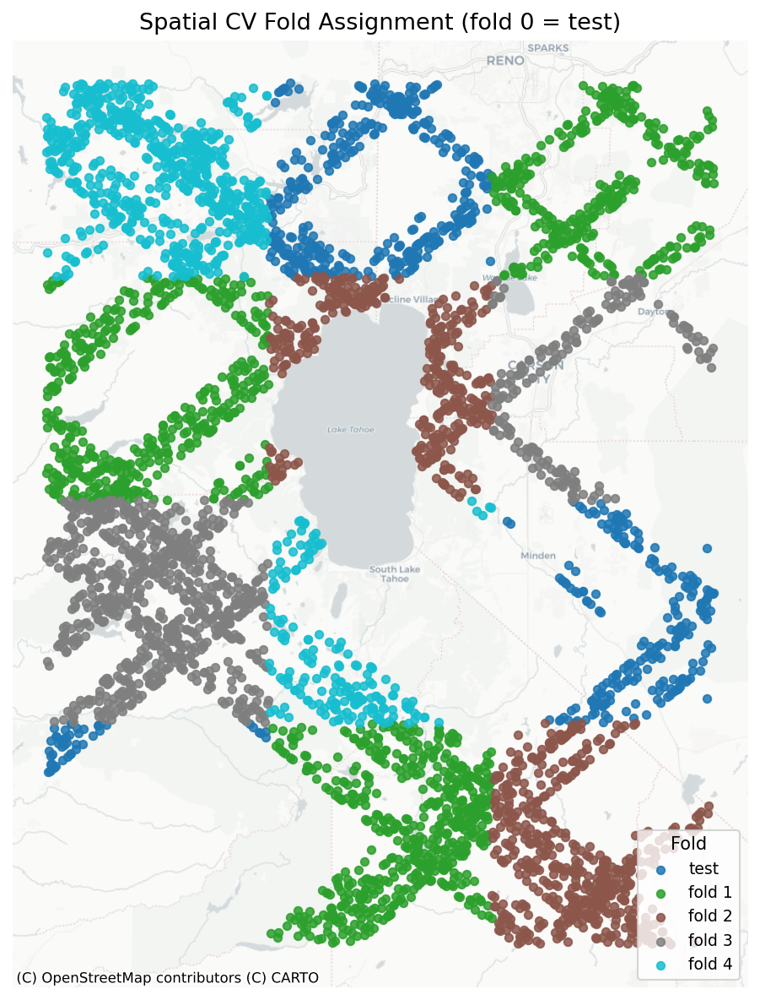

# Canopy Height Estimation Pipeline

> **GEDI L2A + Sentinel-2 → XGBoost** — an agentic data pipeline that ingests NASA lidar shots,
> extracts cloud-masked Sentinel-2 spectral features, validates spatial CV readiness,
> and prepares training-ready data for canopy height prediction.


---

## What This Does

Forest canopy height is a key metric for carbon stock estimation, wildfire risk, and biodiversity monitoring. This pipeline fuses two NASA/ESA datasets — **GEDI L2A** lidar shots (ground-truth canopy height at 25m footprint) and **Sentinel-2** multispectral imagery — into a spatially cross-validated training dataset ready for XGBoost regression.

The entire ingest → transform → QA workflow is driven by a **multi-agent LLM system** that self-diagnoses failures, replans parameters, and aborts gracefully when data conditions are unresolvable.

---

## Architecture

```
main.py  ──► run_orchestrator()
                │
                ▼
        ┌───────────────────────────────────────────────┐
        │            Orchestrator Agent                  │
        │  (Claude Sonnet 4.6 via pydantic-ai)           │
        │                                                 │
        │  1. run_ingestor ──► Ingestor Agent            │
        │     • query_gedi_earthengine (GEE)             │
        │     • query_sentinel2 (GEE)                    │
        │     • apply_quality_filters                    │
        │     • write_raw_shots_to_db                    │
        │                                                 │
        │  2. run_transformer ──► Transformer Agent      │
        │     • extract_sentinel_bands (GEE, parallel)   │
        │     • compute_variogram                        │
        │     • generate_spatial_blocks                  │
        │     • assign_folds                             │
        │     • write_cleaned_shots_to_db                │
        │                                                 │
        │  3. run_qa ──► QA Agent                        │
        │     • read_cleaned_shots_from_db               │
        │     • check_feature_distributions              │
        │     • check_fold_balance                       │
        │     • check_target_range                       │
        │                                                 │
        │  On failure: replan() ──► retry failed stage   │
        │  Max replans exceeded: abort()                  │
        └───────────────────────────────────────────────┘
                │
                ▼
        PipelineState (dataclass)
        SQLite via SQLAlchemy ORM
        Logfire traces (per agent + tool)
```

The **Orchestrator** is the single entry point. It calls sub-agents as pydantic-ai tools, inspects their typed `passed` / `recommended_action` output, and applies adaptive replanning (`replan_widen_date`, `replan_relax_thresholds`) before retrying — up to `max_replans`. All intermediate state is persisted to SQLite so any stage can be inspected or replayed without re-running expensive GEE queries.

---

## Agents

| Agent | Responsibility | Key Tools |
|---|---|---|
| **Orchestrator** | Drive the pipeline, replan on failure, abort when unresolvable | `run_ingestor`, `run_transformer`, `run_qa`, `replan`, `abort` |
| **Ingestor** | Query GEDI shots + S2 scene availability; filter by quality flags, sensitivity, slope | `query_gedi_earthengine`, `query_sentinel2`, `apply_quality_filters`, `write_raw_shots_to_db` |
| **Transformer** | Sample S2 bands at shot locations; estimate spatial autocorrelation; assign spatial CV folds | `extract_sentinel_bands`, `compute_variogram`, `generate_spatial_blocks`, `assign_folds` |
| **QA** | Validate feature completeness, EVI/NDVI range, fold balance before training | `check_feature_distributions`, `check_fold_balance`, `check_target_range` |

Each agent returns a typed Pydantic output model (`IngestorDecision`, `TransformerDecision`, etc.) with `passed`, `rationale`, `recommended_action`, and `warnings` fields — the LLM cannot return a structurally invalid decision. GEE tools catch all exceptions and return `{"error": "..."}` dicts so the orchestrator receives a structured failure signal rather than triggering an unintended LLM retry.

---

## Sample Output

GEDI shots colored by `rh98` (canopy height in metres) over the Sierra Nevada, CA. Spatial CV folds are assigned using a variogram-estimated block size (≥1.5× autocorrelation range) to ensure training and validation sets are spatially decorrelated — a critical guard against optimistic CV scores in geospatial ML:

<p align="center">
  
  
</p>

---

## Tech Stack

| Tool | Role |
|---|---|
| **[pydantic-ai](https://ai.pydantic.dev)** | Agent framework — typed deps, tool registration, structured LLM output |
| **[Google Earth Engine](https://earthengine.google.com)** | GEDI L2A index queries + Sentinel-2 median composites, cloud masking via SCL |
| **[Logfire](https://logfire.pydantic.dev)** | Real-time observability — per-agent spans, tool-call events, LLM traces |
| **SQLAlchemy + SQLite** | ORM-backed persistence for raw shots, cleaned shots, agent decisions |
| **[pytest](https://pytest.org)** | 88 tests across unit (mocked tools), integration (live GEE), and runner layers |
| **[geopandas](https://geopandas.org) + [contextily](https://contextily.readthedocs.io)** | Spatial DataFrames + tile basemaps for diagnostic figures |
| **[uv](https://github.com/astral-sh/uv)** | Fast dependency management and virtual environments |

---

## Running the Pipeline

```bash
uv run python -m canopy_height_prediction.main \
  --bbox "-120.5,38.5,-119.5,39.5" \
  --date-start "2022-06-01" \
  --date-end "2022-09-01" \
  --output output/run.json \
  --save-figs output/
```

```
Run ID : run-9af5a9fc
AOI    : (-120.5, 38.5, -119.5, 39.5)
Dates  : 2022-06-01 → 2022-09-01
------------------------------------------------------------
Ingestor  : PASS  (128369/177310 shots accepted)
Transformer: PASS  (block=28.75 km, folds=5)
QA        : PASS  issues=[]
Replans   : 0
```

## Testing

```bash
uv run pytest tests/ -v   # 88 tests: unit + integration (live GEE)
```

Tests are layered: **unit tests** mock agent tools and assert decision logic; **integration tests** hit live GEE endpoints with small seeded datasets; **runner tests** verify `PipelineState` writeback for each agent.

---

## Design Notes

- **GEE extraction**: `sampleRegions` batches 500 shots per request (payload limit) and runs batches concurrently via `ThreadPoolExecutor`. Shots are capped at 5,000 before extraction — sufficient for XGBoost without 100+ sequential GEE calls. Scale is 20m with `tileScale=4`.
- **Spatial CV block size**: geometrically capped so the AOI always yields ≥ `n_folds+1` occupied blocks, preventing fold imbalance when the variogram range is large relative to the AOI.
- **Replanning audit trail**: every agent decision (rationale, action taken, parameters) is written to the `agent_decisions` table and the `PipelineState.decision_log`, making post-run debugging reproducible without re-running GEE.
- **Logfire observability**: `logfire.instrument_pydantic_ai()` auto-instruments all tool calls; `logfire.info()` events fire at agent entry so each stage is visible in real time rather than only on completion.

---

## TBD — Model Training

The following components are planned but not yet implemented:

| Component | Description |
|---|---|
| `modeling/train.py` | XGBoost regression on spatially CV-validated folds; hyperparameter tuning via Optuna |
| `modeling/predict.py` | Inference on new AOIs using trained model + S2 feature extraction |
| `modeling/evaluate.py` | Per-fold RMSE / R² reporting; feature importance plots |
| Training agent | LLM-guided hyperparameter selection and early stopping decisions |
| Model registry | MLflow or similar for experiment tracking and model versioning |
